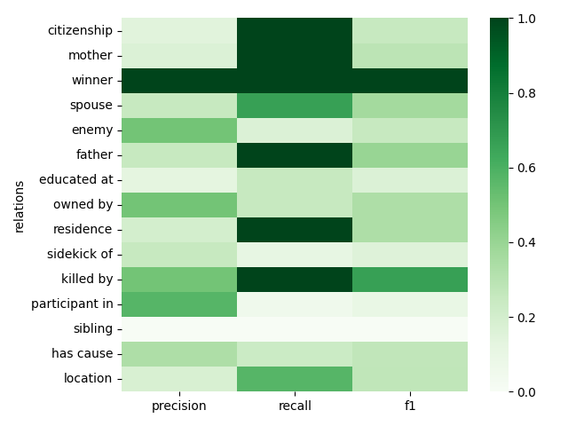
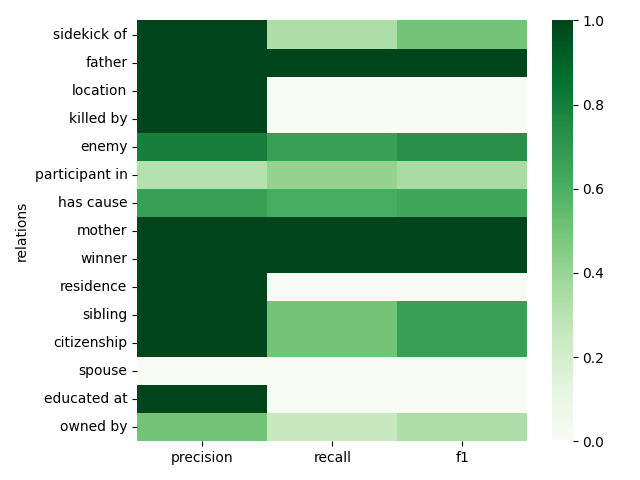

Cite as:

Vallejo Arginzoniz, E. and Pianzola, F. (2023). Fandom-wiki scraper. https://doi.org/10.5281/zenodo.14911366

# Fandom-wiki
Extraction of structured and unstructured information from fandom.com pages.

This repo contains the following:

* Metadata files (`data/`)
* Python programs that can either serve as modules or be used as stand-alone scripts (`src/`)
* Bash scripts that perform very specialized operations (`scripts/`)

## Table of Contents
- [Setup and Dependencies](#setup-and-dependencies)
- [Usage of Main Functionalities](#usage-of-main-functionalities)
  - [Download and Parse Web Data](#download-and-parse-web-data)
    - [Customizing the Data Download Pipeline](#customizing-the-data-download-pipeline)
  - [Parsing WikiText Elements](#parsing-wikitext-elements)
  - [Relation Extraction from Text](#relation-extraction-from-text)
    - [Reducing Relation Extraction to a Question Answering Task](#reducing-relation-extraction-to-a-question-answering-task)
    - [LLM prompting for direct Relation Extraction](#llm-prompting-for-direct-relation-extraction)
  - [Evaluating Relation Extraction Performance](#evaluating-relation-extraction-performance)
- [Discussion and Comparison of Relation Extraction Methods](#discussion-and-comparison-of-relation-extraction-methods)


## Setup and Dependencies
All the code is developed for and tested on:
* Python 3.10(.9)
* Bash 5.1.16

However most functionality is expected to work on similar setups.

To start using the repo install the PyPy packages listed in `requirements.txt` using the `pip` package manager:

`pip install -r requirements.txt`

The only non-PyPy software requirement is the `curl` terminal application. Which is only required for downloading data from web-servers.

## Usage of Main Functionalities

_Technical Detail_: Most scripts (python or bash) use standard input/output streams to consume/produce data so that the same interface may be used to: be fed and feed other processes, or, read and write from/to files. In particular, this means that many of the individual functionalities bellow can be chained by use of the appropriate system IPC mechanisms.

### Download and Parse Web Data

`scripts/download_fandom_data.sh` provides functionality to donwload and parse the WikiText source of fandom pages from a list of links. The links are read from standard input, one link per line, comments starting with "#" are ignored.

To read the links from a file that lists them (such as `data/fandom_links.txt`):

`scripts/download_fandom_data.sh < data/fandom_links.txt`

or using pipes `|`:

`cat data/fandom_links.txt | scripts/download_fandom_data.sh`

In the above command, `cat` may be substituted by any program that produces (in stdout) links in the described format, for instance a web-crawler that identifies the pages of interest.

By default, the script spits out the WikiText (all articles concatenated) to standard output, this may be used to write a single file containing all the WikiText data:

`scripts/download_fandom_data.sh < data/fandom_links.txt > data/all_wikitext.txt`

If separation of the data from each link is wanted, the `-od` option can be used to specify an "output directory" in which to dump the files corresponding to the articles pointed by each link. The files will be organized in subdirectories according to the name of the wiki they belong to.

`scripts/download_fandom_data.sh -od data/wikis/ < data/fandom_links.txt`

The above script will produce a directory tree looking similar to (with possibly more data):

```
data
├── fandom_links.txt
└── wikis
    ├── harrypotter
    │   ├── Draco_Malfoy.txt
    │   └── Sirius_Black.txt
    ├── marvelcinematicuniverse
    │   ├── Black_Widow.txt
    │   ├── Captain_America.txt
    │   └── Winter_Soldier.txt
    └── starwars
        ├── Anakin_Skywalker.txt
        ├── Ben_Solo.txt
        └── Rey_Skywalker.txt
```

#### Customizing the Data Download Pipeline
For **large-scale download** operations, flooding the web-servers with requests typically sets off anti-saturation mechanisms from the servers. As a consequence the download speed capacity is largely limited and sometimes slowed down to a halt, for instance if the server blacklists the IP temporarily as a preemptive measure against DDoS attacks.

There are many strategies that may be employed to mitigate this situation. One reliable solution when applicable, is to exchange metadata with the web-server to ensure that request policies are followed and, possibly, announce the good intent of the requests (when the web-server implements such policies). Most download managers can be configured to behave _perceptivelly_ like described.

Since the download script uses `curl` under-the-hood, it will benefit from the configuration to curl. To customize (locally) the `curl` configuration, create a `.curlrc` file in the preferred directory:

`mkdir config && touch config/.curlrc`

then edit the file and include the necessary confuration ([curl reference](https://everything.curl.dev/)). Finally execute the download command with the `CURL_HOME` environment variable set to the directory where `.curlrc` is located:

`CURL_HOME=${PWD}/config/ scripts/download_fandom_data.sh -od data/wikis/ < data/fandom_links.txt`

As another alternative, one may decide to implement a custom download script. In that case it is worth having a look at `src/fandom_extraction/fandom_extract.py`, which implements the HTML parsing capabilities (it obtains the WikiText from the article editing HTML page).

### Parsing WikiText Elements
Parsing WikiText elements involves extracting structured units of data from a WikiText source file. Some example of these units are **Templates** (such as InfoBoxes or Quotes), **Categories**, **Links (to other articles)**, **References** and **Sections** among others. So far only template extraction is fully implemented.

To perform WikiText parsing `src/fandom_extraction/wikitext_extract.py` is a python script that has a variety of options that enable different extraction, filtering and cleaning operations. The script works by reading WikiText from standard input, it then writes the parsed elements in `JSON` format to standard output.

To showcase a particular use-case, lets consider:

`cat data/wikis/*/* | python -m src.fandom_extraction.wikitext_extract --templates Character character "Character Infobox" "Individual infobox" --template_param_wl name sex born nation affiliation job actor --clean_xml > data/infobox_templates.json`

Breaking the command down:

* `cat data/wikis/*/*` Concatenates all (previously) donwloaded fandom articles
* `python src.fandom_extraction.wikitext_extract` The wikitext parsing script ran as a python module, it consumes the concatenated wikitext
* `--templates Character character "Character Infobox" "Individual infobox"` Extract the templates that match the given template names. In this case the template names correspond to the Infobox generation templates.
* `--template_param_wl name sex born nation affiliation job actor` Store only the given parameters (infobox fields in this case) from the extracted templates.
* `--clean_xml` Clean the XML data in the WikiText before parsing. XML data is often not interesting (page styling for example) so we don't want it in the output. Cleaning XML also makes parsing faster as there is less text to parse and less complexity.
* `> data/infobox_templates.json` Redirect the output to an output file (instead of letting it print in the terminal).

The script parameters `--templates` and `--template_param_wl` take a list of names in the example, however regular expressions (and lists of them) are also allowed so the above parameter values can be written as

`--templates "([Cc]aracter|[Ii]ndividual)( [Ii]nfobox)?"`

and

`--template_param_wl "name|sex|born|nation|affiliation|job|actor"`

There are plenty other options that the script accepts which can be consulted in detail by using the parameter `--help`

`python -m src.fandom_extraction.wikitext_extract --help`

Finally if the WikiText parser implementation is of interest, it is available in the python module `src/fandom_extraction/wikitext_regex.py`

### Relation Extraction from Text

At the time of writing this guide, two fundamentally distinct methods have been implemented for relation extraction:

1. Reducing Relation Extraction to a Question Answering Task.
2. LLM prompting for direct Relation Extraction.

We shall next briefly describe each approach.

#### Reducing Relation Extraction to a Question Answering Task

In this approach we reduce the task of extracting a relation triple `<subject>:<relation>:<object>`, to answering a question of the type `"What entity has relation <relation> with <subject>?"` or possibly a more natural question for the given `subject` and `relation`. E.g. to extract the relation `<Harry Potter>:<enemy of>:<Voldemort>`, we might ask the question `"Who is an enemy of Harry Potter?"`. We then feed the question, together with the text that relation extraction is to be performed on, as context to an Extractive-Question-Answering system (in particular, we used a QA fine-tunned LM). The answer outputed by the system (if any), is then a `<object>` candidate, which we might keep or discard according to different criteria (such as the confidence of the QA system in the answer).

To implement this scheme three data sources are needed:
1. Question templates associated to each relation (e.g. ). Each relation might have more than one associated question.
2. List of entities to place as subject in the relations (e.g. )
3. Piece of text to perform relation extraction on.

From the first two (1,2), all the possible triples which have a subject from (2) and a relation from (1) are considered. Some optimization is possible if entities have a class annotated and the relations specify the classes that they support. Then the questions associated to all the triples are created and fed to the QA system along with context, thus generating answers to the questions. To do this run:

`python -m src.relation_extraction.qa --entities <entites_file> --relations <relations_file> < <context_file> > <output_file>`

for example:

`python -m src.relation_extraction.qa --entities data/meta/test_entities.csv --relations data/meta/annotations_relations_handcrafted.txt < data/wikis/harrypotter/Hermione_Granger.txt > results/hermione_answers.json`

The context (`<context_file>`) is formatless text, the expected format and fields for the rest of data sources can be checked in the files referenced in the example. The script outputs a `.json` file that contains the generated answers for each question in `<relations_file>`.
Additional options are available through command line arguments (e.g. to controll the underlying QA model, and its parameters), the documentation can be accessed through `python -m src.relation_extraction.qa --help`.

We have thus far extracted the output (answers) from the QA segment of the pipeline, however for most purposes (benchmarking, compatibility, knowledge graph building, ...) we are interested in relation triples, so it is time to reduce answers into triples. To that end, we can employ the following script:

`python -m src.relation_extraction.relations_from_answers --answers <answers_file> > <output_relations>`

Where `<answers_file>` is the previously obtained output and `<output_relations>` will be a `.csv` file with triples, and possibly a confidence score of the system for each triple. As with the previous script, there are a lot of options to tailor the behaviour of the script to each users need. Once again, consult them trough the `--help` argument.

There is only one thing left to do, which is to evaluate the generated relations, since this part of the workflow is common to every relation extraction method it will be discussed in a separate section. We will now comment on the other implemented approach, namely the use of LLMs to solve the task direclty.

#### LLM prompting for direct Relation Extraction

To use an LLM to solve the task we must feed it an appropriate __prompt__ that gives the LLM clear instructions on what the task consists on, and what the output text is expected to look like (i.e. the format). Additionally one may include examples of input-output pairs so as to illustrate the task at hand (fewshot approach). Finally, we include a new instance of the relation extraction task in the prompt and feed it to the model.

To that end, we created a prompt template that describes each target relation, and asks for the output in `JSON` format. It then provides some cherry-picked examples, each one consists on a passage where the relations must be found followed by the relations themselves in `JSON` format (a list of dictionaries). To run the system with the prompt we provide the script:

`python -m src.relation_extraction.llm --relations <relations_file> --target <target_file> --examples <examples_file> > <llm_output>`

The output is given in `JSON` format, as a list of maps, where for each map there is a field for the `context` and a field for the llm output (`model_prediction`), for example:

`python -m src.relation_extraction.llm --relations data/meta/cherry_picked_relations.csv --target data/annotation/harry_potter_annotations.csv --examples data/fewshot/cherry_picked_examples.csv > results/llm_output.json`

With a bit of luck, the model will produce the correct output in the desired format, however the quality of the output greatly depends on the complexity (parameter count and training scheme) of the underlying LLM. In any case it is always desirable to validate the output so that it conforms to the given specification. To do this use:

`python -m src.relation_extraction.relations_from_llm_output --llm_output <llm_output> --relations <relations_file> > <llm_relations>`

where `<llm_output>` is the output from the previous script and `<relations_file>` is the same for both scripts, the outupt is given as a `.csv` file of triples, which complies with the format (column names) that is used for the QA relation extraction method. As with all scripts, there are many options to look at, which can be consulted through `--help`.

### Evaluating Relation Extraction Performance

Once we have extracted relation triples using our preferred method, we may want to evaluate the quality of these triples by comparing them with ground-truth data. Provided we have such facilities, or that we at least have ground-truth triples for a small subset of the task instances, we can use this evaluation and the performance scores that come of it to get an idea of the reliability of the relation-extraction pipeline. This validation step grants trust (or distrust) in the system as an automatic annotation tool, which is essential for pipelines that include followup steps.

To perform evaluation of the extracted triples (as extracted in `.csv` format) a handy script is provided:

`python -m src.utils.compute_eval_score --predictions <predictions_file> --gold <gold_file> > <scores_file>`

where `<gold_file>` contains the ground-truth triples in the same format as `<predictions_file>` (i.e. `.csv` with same columns). Additionally, a `--relations <relations_file>` option may be used to constrain the evaluation to a reduced set of relations, which can prove useful in many instances. `<score_file>` is a `.csv` file that contains __precision__, __recall__ and __F1__ scores for each relation individually and as aggregated __microaverage__ and __macroaverage__ scores. There are other options available to control the strictness when comparing relation which can be consulted with `--help`.

## Discussion and Comparison of Relation Extraction Methods

The two implemented relation extraction techniques differ significantly, and may thus be applied in different scenarios and for different needs. For example, the __QA reduction__ pipeline offers more interpretable results since there is an intermediate step, where the QA system (which is a blackbox deeplearning system) answers specific questions on context. Inspecting these answers can bring up different failure modes and help identify strenghts and weaknesses, as well as aiding in the construction of appropriate relation-to-question reductions, giving, as a consequesnce, a high degree of customizability. The __LLM prompting__ method offers no such thing as the output of the blackbox system are directly the relation triples, however there is some headroom for customization by means of adapting the __prompt__. 

On the other hand, the observed performance when using __LLM prompting__ (with bloom, the biggest tested LLM with 176B param) is considerably superior to that of __QA reduction__ (see table below). 

| | Precision (micro) | Precision (macro) | Recall (micro) | Recall (macro) | F1 (micro)| F1 (macro) |
| ------------- | ------------- | ------------- | ------------- | ------------- | ------------- | ------------- |
| __QA reduction__ (Roberta-Large) | 33.1 | 10.5 | __55.3__ | 18.8 | 32.3 | 13.4 |
|  __LLM prompting__ (Bloom) | __81.9__ | __40.5__ | 41.8 | __39.8__ | __45.9__ | __40.2__ |

QA Reduction            |  LLM Prompting
:-------------------------:|:-------------------------:
  |  

  


Finally, while both systems are based on deeplearning language models, the size of the models are about three orders of magnitude apart, the __LLM prompting__ technique requireing around __1TB__ of memory to run, which in turn often forces the use of __CPU__ nodes rather than __GPU__ slowing down the process further. In case compute resources are not locally available, another option is using cloud inference services such as the one provided by __HuggingFace__ or __OpenAI__ (for GPT / ChatGPT), although these services always require a paid subscription.

In the next table we outline some of the differences of both approaches:

| | QA reduction | LLM prompting |
| ------------- | ------------- | ------------- |
| __Performance__ | Baseline | Moderate |
| __Interpretability__ | Moderate | None |
| __Customizability__ | High  | Moderate |
| __Compute Requirements__ | Moderate | Very High |


